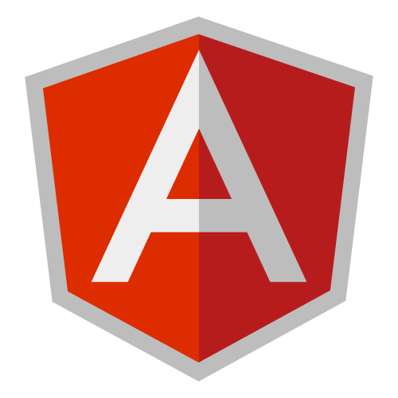

    

<h1 align="center">
  Let's Connect and have a Chat!💬
</h1>

---

<h2>Frameworks I have been using</h2>

<!---
qianjun-ql/qianjun-ql is a ✨ special ✨ repository because its `README.md` (this file) appears on your GitHub profile.
You can click the Preview link to take a look at your changes.
--->
